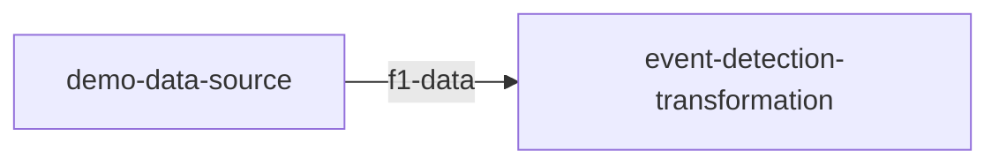



## How It Works

The `quix local pipeline view` command generates a visual representation of your pipeline using a mermaid diagram. When executed, it creates or updates the `pipeline.md` and `quix-pipeline.html` files in your project directory. 

These files contain mermaid code that visualizes your pipeline's structure and data flow. The command can open these files in VS Code or your default browser, providing an interactive and up-to-date view of your pipeline configuration. This helps you easily visualize and document your pipeline setup.

## Example Usage

### Using VS Code

To view the pipeline documentation in VS Code, use the following command:

```
$ quix local pipeline view
✓ 'pipeline.md' was updated
✓ VS Code started
```

This command updates the `pipeline.md` file and opens it in VS Code automatically, allowing you to view and edit your pipeline documentation directly in the editor.


The `pipeline.md` file is generated with the following mermaid code to visualize your pipeline:

```markdown
%%{ init: { 'flowchart': { 'curve': 'monotoneX' } } }%%
graph LR;
demo-data-source[demo-data-source] -->|f1-data|event-detection-transformation[event-detection-transformation];
```

### Without VS Code

If you prefer not to use VS Code or it is not installed, you can still view the pipeline documentation in your browser. Use the same command:

```
$ quix local pipeline view
```

This command will attempt to open the generated `quix-pipeline.html` file in your default browser. If it does not open automatically, you will see a message with a file path like this:

```
Open file:///path/to/your/temp/quix-pipeline.html in your browser if the link didn't open in your browser.
```

Simply click the provided link to access the pipeline documentation.

The `quix-pipeline.html` file will render the following mermaid graph:



!!! tip

    Both `pipeline.md` and `quix-pipeline.html` are automatically updated every time the `quix.yaml` file is modified using the Quix CLI. This ensures that your documentation remains current with the latest configuration changes.