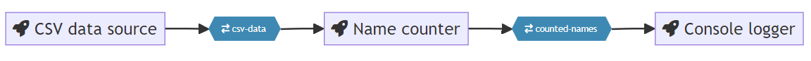



## How It Works

The `quix pipeline view` command generates a visual representation of your pipeline using a mermaid diagram. When executed, it creates or updates the `pipeline.md` and `quix-pipeline.html` files in your project directory. 

These files contain mermaid code that visualizes your pipeline's structure and data flow. The command can open these files in VS Code or your default browser, providing an interactive and up-to-date view of your pipeline configuration. This helps you easily visualize and document your pipeline setup.

## Example Usage

```
$ quix pipeline view
```

This command will attempt to open the generated `quix-pipeline.html` file in your default browser. If it does not open automatically, you will see a message with a file path like this:

```
Open file:///path/to/your/temp/quix-pipeline.html in your browser if the link didn't open in your browser.
```

Simply click the provided link to access the pipeline documentation.

The `quix-pipeline.html` file will render a graphical representation of the pipeline in your default web browser:



!!! tip

    Both `pipeline.md` and `quix-pipeline.html` are automatically updated every time the `quix.yaml` file is modified using the Quix CLI. This ensures that your documentation remains current with the latest configuration changes.

!!! info

    If, for any reason, the CLI fails to open your browser and detects that Visual Studio Code (VS Code) is installed, it will automatically open the pipeline visualization in VS Code instead.