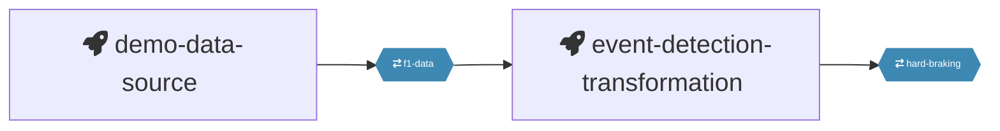



## How It Works

The `quix pipeline view` command generates a visual representation of your pipeline using a mermaid diagram. When executed, it creates or updates the `pipeline.md` and `quix-pipeline.html` files in your project directory. 

These files contain mermaid code that visualizes your pipeline's structure and data flow. The command can open these files in your default browser, providing an interactive and up-to-date view of your pipeline configuration. This helps you easily visualize and document your pipeline setup.

## Example Usage

To view the pipeline documentation, use the following command:

```
$ quix pipeline view
✓ The pipeline view was updated
If the link doesn't show automatically, open file:///path/to/your/temp/quix-pipeline.html in your browser
```
This command updates the pipeline.md and a temporary quix-pipeline.html file, which opens automatically in your browser. This allows you to view and interact with your pipeline documentation directly.

The screenshot below illustrates how the pipeline view appears when opened in a browser. It visually represents the structure and data flow of your pipeline, making it easy to understand and document your setup.




### VS Code and GitHub 

Visual Studio Code can display the pipeline diagram if you install the [Markdown Mermaid](https://marketplace.visualstudio.com/items?itemName=bierner.markdown-mermaid) extension.

Similarly, GitHub will automatically render the `pipeline.md` file with the included mermaid code, allowing you to visualize your pipeline directly on the platform.

The `pipeline.md` file is generated with the following mermaid code to visualize your pipeline:

```markdown
%%{ init: { 'flowchart': { 'curve': 'monotoneX' } } }%%
graph LR;
demo-data-source[fa:fa-rocket demo-data-source &#8205] --> f1-data{{ fa:fa-arrow-right-arrow-left f1-data &#8205}}:::topic;
f1-data{{ fa:fa-arrow-right-arrow-left f1-data &#8205}}:::topic --> event-detection-transformation[fa:fa-rocket event-detection-transformation &#8205];
event-detection-transformation[fa:fa-rocket event-detection-transformation &#8205] --> hard-braking{{ fa:fa-arrow-right-arrow-left hard-braking &#8205}}:::topic;


classDef default font-size:110%;
classDef topic font-size:80%;
classDef topic fill:#3E89B3;
classDef topic stroke:#3E89B3;
classDef topic color:white;
```

!!! tip

    Both `pipeline.md` and `quix-pipeline.html` are automatically updated every time the `quix.yaml` file is modified using the Quix CLI. This ensures that your documentation remains current with the latest configuration changes.