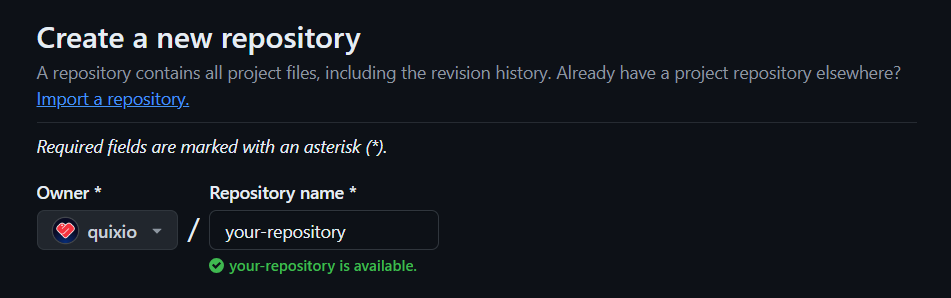
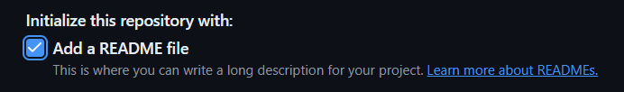
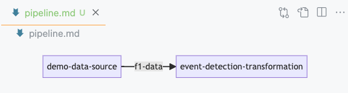
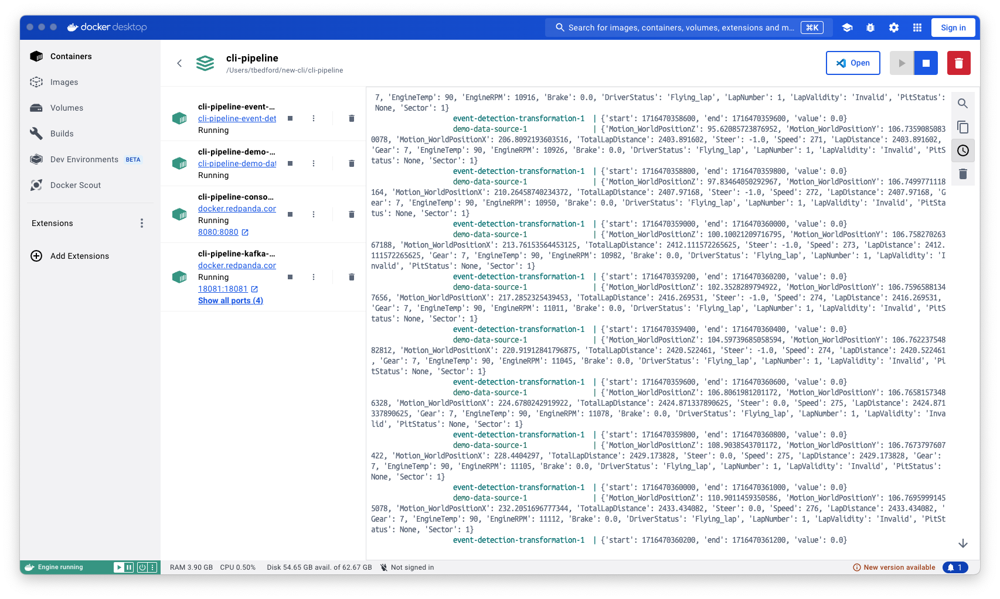
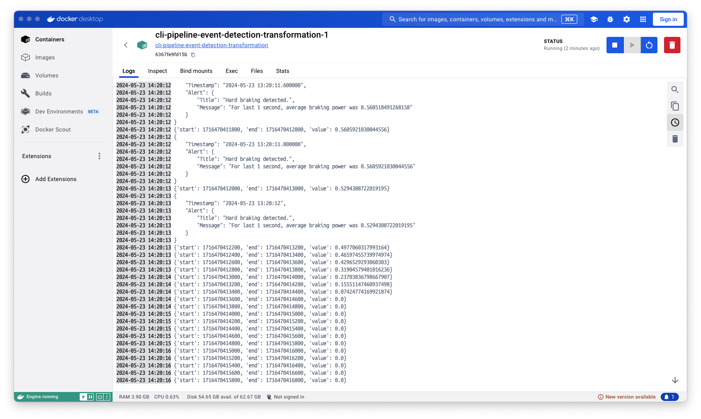

# Quix CLI Quickstart

In this guide you will use the Quix CLI to **create a simple streaming pipeline**, and test it locally by running it in Docker. The pipeline generates telemetry data from a car and processes it to **send an event** whenever the driver applies a **hard brake**.

You will learn how to:

1. **Install Quix CLI**: Get the CLI tool up and running on your local machine.
2. **Verify Dependencies**: Ensure you have all necessary tools like Docker and Git.
3. **Initialize a Quix Project**: Set up your project directory and configuration files.
4. **Create Source and Transform Applications**: Build applications to produce and process data.
5. **Run and Manage Your Pipeline**: Run your pipeline locally using Docker and manage it through the Quix CLI.

By the end of this guide, you'll have a fully functional data pipeline running locally. Let's get started!


## Prerequisites

This guide assumes you have the following installed in your local machine:

* [Docker Desktop](https://docs.docker.com/engine/install/){target=_blank}
* [Git](https://git-scm.com/book/en/v2/Getting-Started-Installing-Git){target=_blank}

## Step 1: Install Quix CLI

To install Quix CLI:

=== "macOS"

    ``` bash
    curl -fsSL https://github.com/quixio/quix-cli/raw/main/install.sh | bash
    ```

=== "Linux"

    ``` bash
    curl -fsSL https://github.com/quixio/quix-cli/raw/main/install.sh | bash
    ```

=== "Windows"

    ``` powershell
    iwr https://github.com/quixio/quix-cli/raw/main/install.ps1 -useb | iex
    ```

For further details on installation, including instructions for Microsoft Windows, see the [install guide](https://github.com/quixio/quix-cli?tab=readme-ov-file#installation-of-quix-cli){target=_blank}.

!!! tip

    To update Quix CLI just run `quix update` to get the latest version.

## Step 2: Verify dependencies

This guide requires you to have certain dependencies installed. These include [Docker or Docker Desktop](https://docs.docker.com/engine/install/){target=_blank} and [Git](https://git-scm.com/book/en/v2/Getting-Started-Installing-Git){target=_blank}.

To verify you have the dependencies installed, run the following command:

``` bash
quix status
```

View the output carefully to confirm you have Git and Docker installed:

```
✓ Docker detected
✓ Git detected
```

## Step 3: Create a GitHub repository

Create a [**new Git repo**](https://github.com/new){target=_blank} on GitHub to store your project files. 



Initialize the repo with a `README.md` file to make it easier to clone.

 

If you encounter any issues creating your GitHub repository, refer to this [documentation](https://docs.github.com/en/repositories/creating-and-managing-repositories/quickstart-for-repositories){target=_blank} on Github.

## Step 4: Clone your GitHub repo into your local project directory

Copy your GitHub repository URL.

Now, clone the repository using the URL. For example:

``` bash
git clone https://github.com/<your-username>/<your-repository>
```

!!! tip

    Replace `<your-username>` and `<your-repository>` with your actual username and repository name. 

If you encounter any issues cloning your GitHub repository, refer to this [documentation](https://docs.github.com/en/repositories/creating-and-managing-repositories/cloning-a-repository){target=_blank} on Github.

!!! note

    Ensure your GitHub account is [correctly configured in your Git client](https://docs.github.com/en/get-started/getting-started-with-git/set-up-git) to push changes to the remote repository.

## Step 5: Initialize your project as a Quix project

Change into your project directory:

``` bash
cd <your-repository>
```

In your Git project directory, enter ```quix init```. This initializes your Quix project with a `quix.yaml` file, which describes your Quix project. As a convenience a `.gitignore` file is also created for you, or if one is present it is updated to ignore files such as virtual environment files, `.env` files, and so on.:

``` bash
quix init
```

If you look at the initial `quix.yaml` file you'll see the following:

``` yaml
# Quix Project Descriptor
# This file describes the data pipeline and configuration of resources of a Quix Project.

metadata:
  version: 1.0

# This section describes the Deployments of the data pipeline
deployments: []

# This section describes the Topics of the data pipeline
topics: []
```

You can see there are currently no applications (deployments) or topics. 

!!! note

    The `quix.yaml` file defines the project pipeline in its entirety.

## Step 6: Create a source application

Now create a source application that will ingest simulated telemetry data into the broker as if it were coming from a real car in real-time:

``` bash
quix app create demo-data-source
```

When prompted, assign it a name of `demo-data-source`.

This creates a demo data source for you. A directory has been created for this application, along with all the necessary files. You can explore the files created with `ls`.

## Step 7: Create a transform application

Now let's create a simple transform application. This application will read data from the source and will generate a message when a hard braking is detected:

``` bash
quix app create event-detection-transformation
```

When prompted, assign it a name of `event-detection-transformation`.

This creates the transform for you. A directory has been created for this application, along with all the necessary files. You can explore the files created with `ls`.

## Step 8: Update the deployments of your pipeline 

Update the deployments of your pipeline with the newly created applications of the project:

``` bash
quix pipeline update
```

This command adds or updates the deployment configuration of your pipeline based on the default configuration of the existing applications in the project.

!!! tip
    Typically, each application corresponds to a single deployment (1:1). However, the system supports multiple deployments for a single application within your project (1:N)

Now, view your `quix.yaml` file again to see how a deployment for each application has been added:

``` yaml
# Quix Project Descriptor
# This file describes the data pipeline and configuration of resources of a Quix Project.

metadata:
  version: 1.0

# This section describes the Deployments of the data pipeline
deployments:
  - name: demo-data-source
    application: demo-data-source
    deploymentType: Service
    version: latest
    resources:
      cpu: 200
      memory: 500
      replicas: 1
    variables:
      - name: output
        inputType: OutputTopic
        description: Name of the output topic to write into
        required: true
        value: f1-data
  - name: event-detection-transformation
    application: event-detection-transformation
    deploymentType: Service
    version: latest
    resources:
      cpu: 200
      memory: 500
      replicas: 1
    variables:
      - name: input
        inputType: InputTopic
        description: This is the input topic for f1 data
        required: true
        value: f1-data
      - name: output
        inputType: OutputTopic
        description: This is the output topic for hard braking events
        required: true
        value: hard-braking
        
# This section describes the Topics of the data pipeline
topics:
  - name: f1-data
  - name: hard-braking
```

Notice that the `quix.yaml` file has been updated with the variables defined in the `app.yaml` files located in each application folder.

You can also view a graph representation of your local pipeline with the following command:

``` bash
quix pipeline view
```

If you have VSCode installed, the pipeline is displayed in the IDE for you, otherwise the pipeline is displayed on your default browser:



When you update your `quix.yaml` using the command `quix pipeline update`, the visualization is updated for you.

## Step 9: Run your pipeline

Run your pipeline in Docker:

``` bash
quix pipeline up
```

This command generates a `compose.local.yaml` in the root of your project based on your `quix.yaml` file.

You'll see various console messages displayed in your terminal. When these have finished, then your deployed services are running in Docker. 

Now switch to Docker Desktop and view the containers of the pipeline running:



You can also click on a **Event Detection** container and check its logs:



You can see that **hard braking** has been detected!

!!! tip

    A detailed explanation of the applications code is beyond the scope of this guide. However, you can read more about Quix Streams library [here](https://quix.io/docs/quix-streams/introduction.html).

## Step 10: Push your local pipeline to Github

To push your changes to Git, and sync your pipeline to Quix Cloud, enter:

``` bash
quix pipeline sync
```

This **pushes all changes** to your Git repository. If you view your repository in your Git provider (for example GitHub), you'll see your files have been pushed.

This command also **synchronizes** your Git repository with Quix Cloud. But, at this stage you do not have Quix Cloud available, so you will receive the following error message:

```
You're not connected to Quix Cloud
```

## Are you ready to level up?

[**Quix Cloud**](../quix-cloud/why-quix-cloud.md){target=_blank} offers a robust and user-friendly platform for managing data pipelines, making it an ideal choice for organizations looking to streamline their development processes, enhance collaboration, and maintain high levels of observability and security.

- **Streamlined Development and Deployment**: Quix Cloud simplifies the development and deployment of data pipelines with its integrated online code editors, CI/CD tools, and YAML synchronization features.
- **Enhanced Collaboration**: The platform allows multiple users to collaborate efficiently, manage permissions, and maintain visibility over projects and environments.
- **Comprehensive Monitoring and Observability**: Real-time logs, metrics, and data explorers provide deep insights into the performance and status of your pipelines, enabling proactive management.
- **Scalability and Flexibility**: Easily scale resources and manage multiple environments, making it suitable for both small teams and large organizations.
- **Security and Compliance**: Securely manage secrets and ensure compliance with dedicated infrastructure and SLA options.
- **Fully Managed Infrastructure**: Isolated cloud infrastructure, managed Kafka or BYO broker, topics management, and YAML-based infrastructure as code.

## Next steps

<div class="grid cards" markdown>

- __Time to level up?__

    ---

    Deploy your local pipeline to the Cloud, for scalability, observability, and even more Quix magic.

    [Deploy to Quix Cloud :octicons-arrow-right-24:](../quix-cloud/quickstart.md)

</div>
