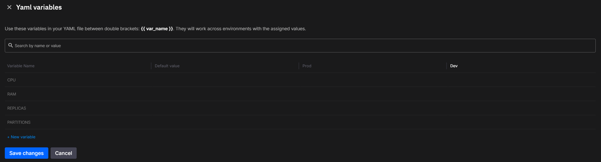

# Managing YAML variables

In the `quix.yaml` file, users can define variables to customize both deployment configurations and topics settings. These variables help in setting specific values for different environments (e.g., production, staging, development) without hardcoding values in the YAML file.

### Cloud-Based Variable Management

This feature is cloud-only, meaning that variable values for each environment (such as production, staging, or development) are set in the cloud. The cloud environment allows you to configure variables dynamically based on your deployment needs.

You can load the variables from the cloud using the CLI command [quix use](../cli-reference/use.md). This command allows you to select an environment (e.g., production or development) and load the variables from the cloud for that environment.



### Local Development with `.quix.yaml.variables`

For local development, instead of setting the values in the cloud, you can use a `.quix.yaml.variables` file to manage variables locally. This file allows you to simulate the cloud-based variable management in your local environment.

If variables are defined in both the cloud and the `.quix.yaml.variables` file, the local file values will override those loaded from the cloud.

The `.quix.yaml.variables` file is a simple text file with `key=value` format.

Example of a `.quix.yaml.variables` file:

```bash
CPU=200
RAM=500
REPLICAS=2
PARTITIONS=2
```

By using this local file, you can test different configurations locally without hardcoding them into the `quix.yaml` file itself.

## Defining YAML Variables

To define variables in `quix.yaml`, use a placeholder format like `{{VAR_NAME}}`. These variables allow users to customize the configuration for both deployments and topics based on different environments.

Here’s an example:

```yaml
resources:
  cpu: {{CPU}}
  memory: {{RAM}}
  replicas: {{REPLICAS}}

# This section describes the Topics of the data pipeline
topics:
  - name: trades
    persisted: false
    configuration:
      partitions: {{PARTITIONS}}
```

In this example, the `CPU`, `RAM`, `REPLICAS`, and `PARTITIONS` variables are set based on the specific environment.

## Managing YAML Variables Locally

For local development, the `.quix.yaml.variables` file is used to set the values for the defined variables in `quix.yaml`. Example:

```bash
# .quix.yaml.variables file
CPU=200
RAM=500
REPLICAS=2
PARTITIONS=2
```

When running the application locally, these values are automatically picked up to simulate the cloud-based variable management.

## Best Practices for Using YAML Variables

- **Use Clear and Descriptive Names**: Always use descriptive names for your variables (e.g., `CPU`, `MEMORY`, `REPLICAS`, `PARTITIONS`) to avoid confusion.
- **Separate Cloud and Local Configurations**: Keep your cloud-based variable management separate from local configurations by using the `.quix.yaml.variables` file for local development.
- **Version Control**: Avoid hardcoding sensitive values like API keys or tokens directly in the YAML file. Use environment variables or secret management tools.
- **Validation**: Ensure that required variables are properly set before deploying. Failing to do so can lead to unexpected behavior in different environments.

## Running the pipeline locally

When you run the [quix pipeline up](../cli-reference/pipeline/up.md) command, the CLI will process both cloud and local variables and then run the pipeline with the correct configuration for the selected environment.

By managing variables this way, you ensure that your deployments and topics are flexible and can adapt to various environments without needing to change the core YAML configuration.
