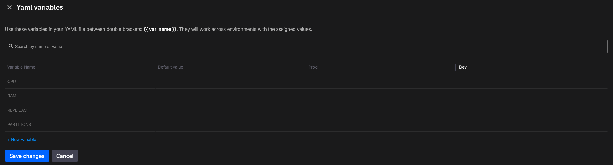

# Managing YAML variables

In the `quix.yaml` file, users can define variables to customize both deployment configurations and topics settings. These variables help in setting specific values for different environments (e.g., production, staging, development) without hardcoding values in the YAML file.

### Cloud-Based Variable Management

This feature is cloud-only, meaning that variable values for each environment (such as production, staging, or development) are set in the cloud. The cloud environment allows you to configure variables dynamically based on your deployment needs.

You can load the variables from the cloud using the CLI command [quix use](../cli-reference/use.md). This command allows you to select an environment (e.g., production or development) and load the variables from the cloud for that environment.



### Local Development with `.quix.yaml.variables`

For local development, instead of setting the values in the cloud, you can use a `.quix.yaml.variables` file to manage variables locally. This file allows you to simulate the cloud-based variable management in your local environment.

If variables are defined in both the cloud and the `.quix.yaml.variables` file, the local file values will override those loaded from the cloud.

The `.quix.yaml.variables` file is a simple text file with `key=value` format.

Example of a `.quix.yaml.variables` file:

```bash
CPU=200
RAM=500
REPLICAS=2
PARTITIONS=2
```

By using this local file, you can test different configurations locally without hardcoding them into the `quix.yaml` file itself.

The same file serves three distinct kinds of lookup, each with its own idea of what the key on the left is:

| Role | Key on the left | Declared in |
|---|---|---|
| Placeholder value | The placeholder name | `{{CPU}}` anywhere in `quix.yaml` |
| Project variable value | The project variable **key** | `variableKey` in `quix.yaml`, `defaultValue` in `app.yaml` |
| Variable group member value | The member **key** | `key` of an entry under a `VariableGroup` variable |

Secret members of a variable group are resolved from this file too — they do not use `.secrets`.

## Defining YAML Variables

To define variables in `quix.yaml`, use a placeholder format like `{{VAR_NAME}}`. These variables allow users to customize the configuration for both deployments and topics based on different environments.

Here’s an example:

```yaml
resources:
  limits:
    cpu: {{CPU}}
    memory: {{RAM}}
  replicas: {{REPLICAS}}

# This section describes the Topics of the data pipeline
topics:
  - name: trades
    persisted: false
    configuration:
      partitions: {{PARTITIONS}}
```

In this example, the `CPU`, `RAM`, `REPLICAS`, and `PARTITIONS` variables are set based on the specific environment.

## Managing YAML Variables Locally

For local development, the `.quix.yaml.variables` file is used to set the values for the defined variables in `quix.yaml`. Example:

```bash
# .quix.yaml.variables file
CPU=200
RAM=500
REPLICAS=2
PARTITIONS=2
```

When running the application locally, these values are automatically picked up to simulate the cloud-based variable management.

## Project Variable Values

A variable declared with `inputType: ProjectVariable` does not carry a value — it carries the **key** of a project variable. That key lives in `variableKey` in `quix.yaml` and in `defaultValue` in `app.yaml`:

```yaml title="app.yaml"
variables:
  - name: DEPLOYMENT_ENV
    inputType: ProjectVariable
    defaultValue: deployment.environment
```

Locally, the value is looked up under that key — `deployment.environment`, not `DEPLOYMENT_ENV`:

```bash title=".quix.yaml.variables"
deployment.environment=develop
```

The resolved value lands in the `### Project Variables ###` section of the generated `.env`, under the variable's name (`DEPLOYMENT_ENV=develop`).

A project variable marked `secret: true` is written blank in `.env` and read from `.quix.yaml.variables` when the application runs. The cloud API withholds the value of a secret project variable, so `.quix.yaml.variables` is the only place a local run can get it from.

## Variable Group Member Values

A variable declared with `inputType: VariableGroup` expands into one entry per member. Each member has its own `key`, and `secret: true` marks the members whose values are kept out of `.env`:

```yaml title="app.yaml"
variables:
  - name: DatabaseConfig
    inputType: VariableGroup
    variables:
      - key: database.host
        defaultValue: localhost
        secret: false
      - key: database.port
        defaultValue: '5432'
        secret: false
      - key: database.password
        secret: true
```

Every member — secret ones included — takes its local value from `.quix.yaml.variables`, keyed by the member `key`:

```bash title=".quix.yaml.variables"
database.host=localhost
database.port=5432
database.password=local-dev-password
```

!!! warning "Group secrets do not live in `.secrets`"
    The `.secrets` file holds values for variables declared with `inputType: Secret` only. A variable group member with `secret: true` is resolved from `.quix.yaml.variables`, exactly like every other member of the group.

A member left without a value is reported by name:

```text
! The variable group key database.password has no value; set it in the '.quix.yaml.variables' file
```

## Seeding the File with `quix init`

`quix init` writes `.quix.yaml.variables` with an empty entry for every key that needs a local value — project variable keys and variable group member keys alike — so you only have to fill in the right-hand side:

```bash title=".quix.yaml.variables"
database.host=
database.port=
database.password=
deployment.environment=
```

`.quix.yaml.variables` is one of the six entries `quix init` adds to `.gitignore`, keeping local values out of version control.

## A Complete Example

An application declaring topics, a free text variable, a secret, a project variable, and a variable group draws its local values from two files:

```bash title=".quix.yaml.variables"
deployment.environment=develop
database.host=localhost
database.port=5432
database.password=local-dev-password
```

```dotenv title=".secrets"
external.api.token=my-api-token-value
```

The generated `.env` carries the resolved values, with everything flagged secret left blank:

```dotenv title=".env"
### Input Topics ###
input=raw-data

### Output Topics ###
output=clean-data

### Secrets ###
API_TOKEN=

### Free Text ###
LOG_LEVEL=info

### Project Variables ###
DEPLOYMENT_ENV=develop

### Groups ###
# GROUP: DatabaseConfig
database__host=localhost
database__port=5432
database__password=
```

Dots in a member key become double underscores in the environment (`database.host` → `database__host`), since a dotted name is not a legal environment variable name. Keep the dotted form in `.quix.yaml.variables`.

`quix pipeline up` reads secret values straight from `.quix.yaml.variables` and `.secrets`, so the container receives them even though `.env` shows them blank:

```yaml title="compose.local.yaml"
    environment:
      database__host: 'localhost'
      database__port: '5432'
      database__password: 'local-dev-password'
      input: 'raw-data'
      output: 'clean-data'
      API_TOKEN: 'my-api-token-value'
      LOG_LEVEL: 'info'
      DEPLOYMENT_ENV: 'develop'
      Quix__Broker__Address: 'kafka_broker:9092'
```

## Best Practices for Using YAML Variables

- **Use Clear and Descriptive Names**: Always use descriptive names for your variables (e.g., `CPU`, `MEMORY`, `REPLICAS`, `PARTITIONS`) to avoid confusion.
- **Separate Cloud and Local Configurations**: Keep your cloud-based variable management separate from local configurations by using the `.quix.yaml.variables` file for local development.
- **Version Control**: Avoid hardcoding sensitive values like API keys or tokens directly in the YAML file. Use environment variables or secret management tools.
- **Validation**: Ensure that required variables are properly set before deploying. Failing to do so can lead to unexpected behavior in different environments.

## Running the pipeline locally

When you run the [quix pipeline up](../cli-reference/pipeline/up.md) command, the CLI will process both cloud and local variables and then run the pipeline with the correct configuration for the selected environment.

By managing variables this way, you ensure that your deployments and topics are flexible and can adapt to various environments without needing to change the core YAML configuration.
